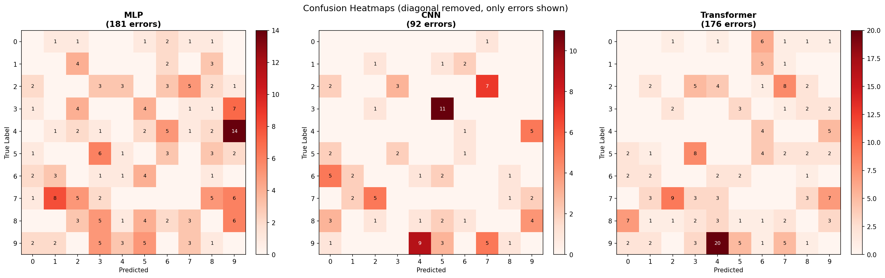

# MNIST Image Recognition: Neural Network Comparison

This project implements and compares three neural network architectures for handwritten digit classification on the MNIST dataset.

## Models

### 1. Shallow Multi-Layer Perceptron (MLP)

- Architecture: Flatten -> Linear(784, 256) -> ReLU -> Linear(256, 10)
- Simple fully-connected baseline with one hidden layer

### 2. Convolutional Neural Network (CNN)

- Architecture: Conv2d(1,16) -> ReLU -> MaxPool -> Conv2d(16,32) -> ReLU -> MaxPool -> Flatten -> Linear(1568, 128) -> ReLU -> Linear(128, 10)
- Two convolutional blocks with max-pooling

### 3. Transformer Encoder

- Architecture: 4x4 patch embedding (49 patches) -> CLS token + learned positional embeddings -> 2-layer TransformerEncoder (4 heads, dim=64, GELU) -> Linear(64, 10)
- Vision Transformer style model adapted for 28x28 images

## Dataset

- **MNIST**: 60,000 training images + 10,000 test images of 28x28 grayscale handwritten digits (0-9)
- Source: `torchvision.datasets.MNIST`
- Preprocessing: ToTensor + Normalize(mean=0.1307, std=0.3081)

## Training Setup

- **Optimizer**: Adam
- **Loss**: CrossEntropyLoss
- **Device**: Apple MPS (Metal Performance Shaders)

## Hyperparameter Tuning

Each model was trained with all combinations of:

- **Epochs**: 10, 15, 20
- **Learning Rate**: 5e-4, 1e-3, 3e-3, 5e-3

This produced 12 runs per model (36 total). Per-epoch train/test metrics are logged in `logs/` and model checkpoints saved in `checkpoints/`.

### MLP Tuning Results

| LR    | Epochs | Train Loss | Train Acc | Test Loss | Test Acc |
|-------|--------|-----------|-----------|-----------|----------|
| 5e-04 | 10     | 0.0211    | 99.44%    | 0.0629    | 98.04%   |
| 1e-03 | 10     | 0.0148    | 99.52%    | 0.0785    | 97.84%   |
| 3e-03 | 10     | 0.0299    | 99.04%    | 0.1217    | 97.66%   |
| 5e-03 | 10     | 0.0541    | 98.55%    | 0.1741    | 97.13%   |
| 5e-04 | 15     | 0.0084    | 99.81%    | 0.0679    | 98.08%   |
| 1e-03 | 15     | 0.0082    | 99.75%    | 0.0773    | **98.19%** |
| 3e-03 | 15     | 0.0215    | 99.38%    | 0.1433    | 97.48%   |
| 5e-03 | 15     | 0.0457    | 98.87%    | 0.2036    | 97.35%   |
| 5e-04 | 20     | 0.0078    | 99.77%    | 0.0748    | 98.17%   |
| 1e-03 | 20     | 0.0068    | 99.76%    | 0.0902    | 98.19%   |
| 3e-03 | 20     | 0.0221    | 99.38%    | 0.1878    | 97.49%   |
| 5e-03 | 20     | 0.0445    | 99.01%    | 0.2542    | 97.27%   |

### CNN Tuning Results

| LR    | Epochs | Train Loss | Train Acc | Test Loss | Test Acc |
|-------|--------|-----------|-----------|-----------|----------|
| 5e-04 | 10     | 0.0152    | 99.49%    | 0.0351    | 98.85%   |
| 1e-03 | 10     | 0.0091    | 99.70%    | 0.0309    | **99.08%** |
| 3e-03 | 10     | 0.0115    | 99.62%    | 0.0535    | 98.66%   |
| 5e-03 | 10     | 0.0138    | 99.59%    | 0.0474    | 98.87%   |
| 5e-04 | 15     | 0.0074    | 99.75%    | 0.0329    | 98.98%   |
| 1e-03 | 15     | 0.0037    | 99.88%    | 0.0475    | 99.00%   |
| 3e-03 | 15     | 0.0114    | 99.65%    | 0.0510    | 98.95%   |
| 5e-03 | 15     | 0.0137    | 99.58%    | 0.0640    | 98.76%   |
| 5e-04 | 20     | 0.0037    | 99.87%    | 0.0438    | 99.00%   |
| 1e-03 | 20     | 0.0021    | 99.92%    | 0.0444    | 99.05%   |
| 3e-03 | 20     | 0.0085    | 99.74%    | 0.0506    | 98.99%   |
| 5e-03 | 20     | 0.0098    | 99.75%    | 0.0895    | 98.84%   |

### Transformer Tuning Results

| LR    | Epochs | Train Loss | Train Acc | Test Loss | Test Acc |
|-------|--------|-----------|-----------|-----------|----------|
| 5e-04 | 10     | 0.1086    | 96.58%    | 0.0938    | 97.08%   |
| 1e-03 | 10     | 0.0901    | 97.08%    | 0.0734    | 97.80%   |
| 3e-03 | 10     | 0.1148    | 96.43%    | 0.0866    | 97.37%   |
| 5e-03 | 10     | 0.2112    | 93.49%    | 0.1853    | 94.37%   |
| 5e-04 | 15     | 0.0785    | 97.42%    | 0.0658    | 97.95%   |
| 1e-03 | 15     | 0.0721    | 97.64%    | 0.0684    | 97.87%   |
| 3e-03 | 15     | 0.1004    | 96.82%    | 0.0796    | 97.78%   |
| 5e-03 | 15     | 0.1870    | 94.18%    | 0.1456    | 95.46%   |
| 5e-04 | 20     | 0.0667    | 97.85%    | 0.0625    | 98.08%   |
| 1e-03 | 20     | 0.0581    | 98.07%    | 0.0577    | **98.24%** |
| 3e-03 | 20     | 0.0951    | 97.04%    | 0.0765    | 97.64%   |
| 5e-03 | 20     | 0.1623    | 94.91%    | 0.1285    | 96.09%   |

## Best Configuration Per Model

| Model       | Best LR | Best Epochs | Test Accuracy | Checkpoint                            |
|-------------|---------|-------------|---------------|---------------------------------------|
| MLP         | 1e-03   | 15          | 98.19%        | checkpoints/mlp_lr1e-03_ep15.pt       |
| CNN         | 1e-03   | 10          | 99.08%        | checkpoints/cnn_lr1e-03_ep10.pt       |
| Transformer | 1e-03   | 20          | 98.24%        | checkpoints/transformer_lr1e-03_ep20.pt |

## Final Test Results (Best Models)

### Overall Accuracy

| Model                | Test Accuracy |
|----------------------|---------------|
| Shallow MLP          | 98.19%        |
| CNN                  | 99.08%        |
| Transformer Encoder  | 98.24%        |
| **Ensemble (Majority Vote)** | **98.70%** |

### Per-Class Accuracy (Best Models)

| Digit | MLP   | CNN   | Transformer |
|-------|-------|-------|-------------|
| 0     | 99.3% | 99.9% | 98.9%       |
| 1     | 99.2% | 99.6% | 99.5%       |
| 2     | 98.2% | 98.8% | 97.9%       |
| 3     | 98.2% | 98.8% | 99.0%       |
| 4     | 97.1% | 99.4% | 99.1%       |
| 5     | 98.2% | 99.4% | 97.6%       |
| 6     | 98.7% | 98.9% | 99.1%       |
| 7     | 97.4% | 99.0% | 97.3%       |
| 8     | 97.5% | 98.8% | 97.8%       |
| 9     | 97.9% | 98.1% | 96.1%       |

### Confusion Matrix Heatmaps (Best Models)

The confusion matrices below show only misclassifications (diagonal removed) for each model's best configuration. Darker cells indicate more frequent confusion between digit pairs.



## Key Observations

1. **CNN achieves the best individual accuracy (99.08%)**, which is expected. Convolutional architectures have strong inductive biases (local connectivity, translation invariance) that are well-suited for image data.

2. **MLP and Transformer perform comparably (~98.2%)**, despite being fundamentally different architectures. The MLP benefits from MNIST's simplicity (28x28 is small enough for fully-connected layers), while the Transformer needs more data to truly shine.

3. **All three models converged best at lr=1e-03**, suggesting Adam with this learning rate is a robust default for MNIST.

4. **Higher learning rates (3e-3, 5e-3) hurt Transformer performance significantly**, dropping to 94-96%. Transformers are known to be sensitive to high learning rates.

5. **The CNN needed the fewest epochs (10)** to reach its best accuracy, while the Transformer needed the most (20). This is consistent with Transformers requiring more training iterations due to lacking built-in spatial priors.

6. **The Ensemble (majority vote) scored 98.70%**, better than MLP and Transformer individually, but below CNN alone. This is because the CNN's strong performance means the other two models occasionally outvote it incorrectly.

## Project Structure

```
Module4/
  mnist_models.ipynb   Main notebook (training, tuning, evaluation, visualizations)
  requirements.txt     Python dependencies
  README.md            This file
  logs/                Per-epoch training metrics (CSV per experiment)
  checkpoints/         Saved model weights (.pt per experiment)
  data/                MNIST dataset (auto-downloaded)
```

## How to Run

```bash
pip install -r requirements.txt
jupyter notebook mnist_models.ipynb
```

Run all cells sequentially. The hyperparameter tuning section takes approximately 15-20 minutes on Apple Silicon (MPS).

## Requirements

- Python 3.10+
- PyTorch
- torchvision
- matplotlib
- jupyter
